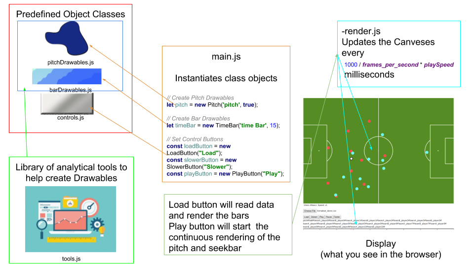

Title: Soccer Visor
Date: 2019-01-01 
Modified: 2010-12-05 19:30
Category: projects
Tags: 
img : https://github.com/AtomScott/soccer-visor/blob/master/img.jpg?raw=true
link: https://github.com/AtomScott/soccer-visor
Authors: Atom Scott, Kaito Yamagata
Summary: 

Sooccer Visor is a tool, created by myself and Kaito Yamagata, used to visualise data in Football.

# Soccer-Visor 0.2

## Introduction

Animator is a animation tool to make research using football tracking data easier.

The current version of animator consists of two 5 major components.

**main**

- main.js
    main.js is where all the global variables (sorry!) are defined and where all the class instances are called. To add new pitch overlays and bars objects should be instantiated here.

**Drawables**

- pitchDrawables.js
    An animation/visualisation tool to show players on a responsive javascript canvas. An overlay can be added for visualisations to show areas or relations such as voronoi diagrams and delaunay triangulations.

- barDrawables.js
    Bars are individual canvases that are used to display time-series data. A seek bar is included by default to allow the user to manually change the time.

**render**

- render.js
    Soccer-Visor utilises the setInterval function to repeatedly draw to the canvases.

**Controls**

- controls.js
    Playback tools are just tools to used mainly to play and pause the animation. There are faster and slower buttons which are used to change the speed rate of the render function.

**Tools**

- tool.js
    Static functions that can be called by any object are put in here.

